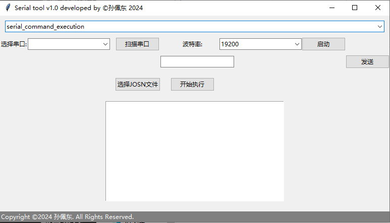
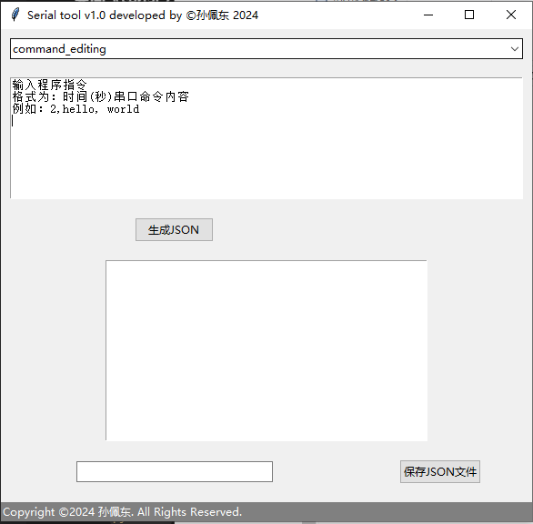

# Serial Command Tool V1.0

本应用1.0版本是一个可以根据josn文件设定时间和内容，由[Github开源项目 10032-bili/Cable-pulling-robot-arm/tree/main/ulcc](https://github.com/10032-bili/Cable-pulling-robot-arm/tree/main/ulcc)的ulcc.py控制程序修改而来，是一种按照规定时间向串口发送命令的工具，可选手动发送串口命令和通过JSON文件定时发送命令序列。并附带json编辑器，适用于串口应用设备管理和调试场景。

## README
[**简体中文**](README.md)     
 [**English**](README_en.md)
## 界面选择
### 界面《serial_command_execution》


`serial_command_execution`
- **串口管理**：
  - 按下`扫描`按钮扫描
  - 在`选择串口`旁的下拉文本框中选择可用的串口。
  - 在`波特率`旁的下拉文本框中配置波特率。
  - 按下`启动`按钮启动串口通信。
- **命令执行**：
  - 在输入框中输入要发向连接的设备发送单个命令。
  - 按下`发送`按钮发送命令。
  - 或者点击`选择JSON文件`按钮选择JSON命令序列。
  - 点击`开始执行`按钮开始执行命令序列。
  - 在下方输出文本框实时显示串口回传的数据。
### 界面《command_editing》


  `command_editing`
- **命令编辑**：
  - 在输入文本框中按格式`执行时间,发送到串口的命令`输入命令序列。
  - 点击`生成JSON`在下方输出文本框预览json
  - 在`保存JSON`按钮左侧文本框输入json文件名
  - 点击`保存JSON`选择保存json文件路径

## 运行条件

### 运行python源码

在运行此python源码之前，请确保安装了以下内容：
- Python 3.x ([**下载python**](https://www.python.org/downloads/))
- `tkinter`库（通常包含在Python中）
- `pyserial`包

如果尚未安装`pyserial`，可以使用pip进行安装：

```bash
pip install pyserial
```
### 运行Windows exe程序
下载封包好的EXE程序并在Windows上运行即可。

[**EXE程序下载**](https://github.com/10032-bili/Serial-Command-Tool/releases/download/V1.0/Serial_Command_Tool.exe)

## 支持
  如需要帮助，请访问"[Github项目 10032-bili/Serial-Command-Tool](https://github.com/10032-bili/Serial-Command-Tool)"项目开源界面联系开发者。
## LICENSE
本程序遵循MIT许可证，您可以在[**LICENSE**](LICENSE)文件中查看完整的许可证文本。


# 注意
**本程序仅供学习参考，请勿用于非法用途。**

* Copyright ©2024 [peidong sun](https://github.com/10032-bili)
* Distributed under MIT license.

* 本程序基于MIT开源，原作者对程序或衍生程序没有任何控制权力，不负任何法律责任！
## LOGO

---
Copyright ©2024 孙佩东. All Rights Reserved.
